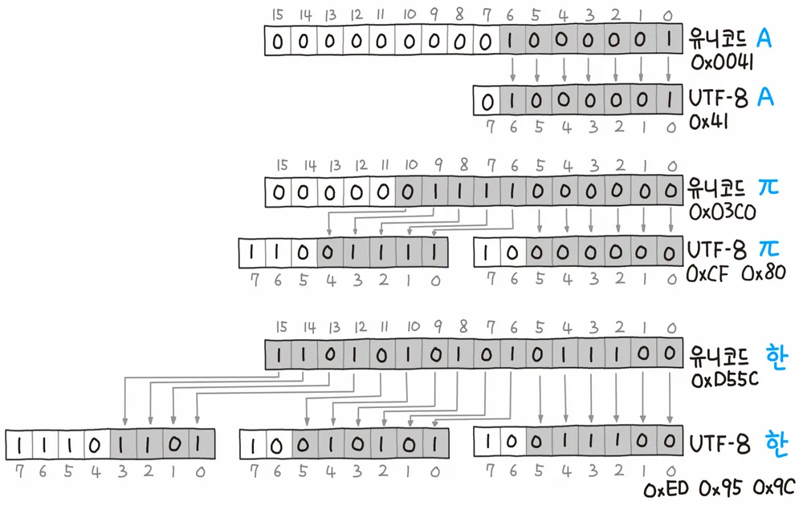

# 유니코드

**Unicode는 전 세계의 문자를 하나의 번호 체계로 표현하기 위한 표준이다.**

쉽게 말하면:

> 문자마다 고유한 번호를 부여한 것


## Unicode와 UTF-8은 다르다

가장 중요한 개념이다.

| 개념 | 역할 |
|---|---|
| **Unicode** | 전 세계의 문자를 하나의 번호 체계로 표현하기 위한 표준 |
| **코드 포인트** | Unicode에서 각각의 문자를 나타내는 번호 |
| **UTF-8** | Unicode 코드 포인트를 1~4바이트로 변환하는 인코딩 방식 |
| **UTF-16** | Unicode 코드 포인트를 2~4바이트로 변환하는 인코딩 방식 |
| **UTF-32** | Unicode 코드 포인트를 4바이트로 표현하는 인코딩 방식 |


```text
U+B9C9
   │
   ├── UTF-8  → EB A7 89
   │
   ├── UTF-16 → B9 C9
   │
   └── UTF-32 → 00 00 B9 C9
```

> **Unicode는 문자에 번호를 부여하는 표준이고, UTF-8/UTF-16/UTF-32는 그 번호를 실제 바이트로 표현하는 방법이다.**


## UTF-8

| UTF-8 비트 패턴 | 전체 크기 | 실제 데이터 (`x`) |
|---|---:|---:|
| `0xxxxxxx` | 8비트 | 7비트 |
| `110xxxxx 10xxxxxx` | 16비트 | 11비트 |
| `1110xxxx 10xxxxxx 10xxxxxx` | 24비트 | 16비트 |
| `11110xxx 10xxxxxx 10xxxxxx 10xxxxxx` | 32비트 | 21비트 |

## UTF-16

| UTF-16 표현 | 전체 크기 | 실제 데이터 | 사용 범위 |
|---|---:|---:|---|
| `xxxxxxxxxxxxxxxx` | 16비트 | 16비트 | `U+0000 ~ U+FFFF` |
| `110110xxxxxxxxxx 110111xxxxxxxxxx` | 32비트 | 20비트 | `U+10000 ~ U+10FFFF` |
- `막`
- 😀

### UTF-16의 기본 구조

| 표현 | 의미 |
|---|---|
| `xxxxxxxxxxxxxxxx` | 하나의 16비트 코드 유닛 |
| `110110xxxxxxxxxx` | High Surrogate |
| `110111xxxxxxxxxx` | Low Surrogate |
| High + Low Surrogate | 32비트로 하나의 Unicode 문자 표현 |

- Surrogate Pair : 
    UTF-16에서 `U+10000 ~ U+10FFFF` 범위의 문자를 표현하기 위해 사용하는 두 개의 코드 유닛이다.

### UTF-8과 UTF-16 비교

| 항목 | UTF-8 | UTF-16 |
|---|---|---|
| 최소 단위 | 1바이트 | 2바이트 |
| 가변 길이 | 1~4바이트 | 2~4바이트 |
| ASCII 문자 | 1바이트 | 2바이트 |
| 한글 | 보통 3바이트 | 보통 2바이트 |
| 최대 표현 범위 | `U+10FFFF` | `U+10FFFF` |
| Unicode 데이터 최대 | 21비트 | 21비트 |